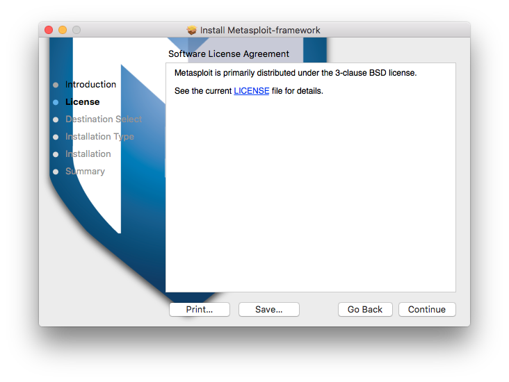
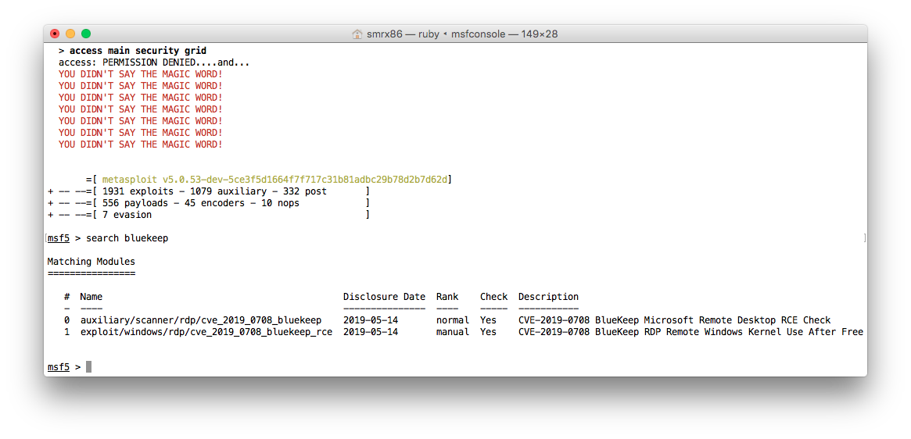

# osx-msf5
Metasploit framework 5 for mac OS user, already tested work in el-capitan (10.11).

# Detail
| Data        | Description |
| ------------- |:-------------|
| File name | metasploit-framework-5.0.53+20191008152708.git.6.2bb1605-1rapid7-1.pkg |
| File size | 206275933 byte |
| MD5 Hash | 6a2a8acff4355b456bd5527bc95c4d26 |
| Distribution | freeware |
| Version | Metasploit framework community |

# Tested
- Installation

- running test

